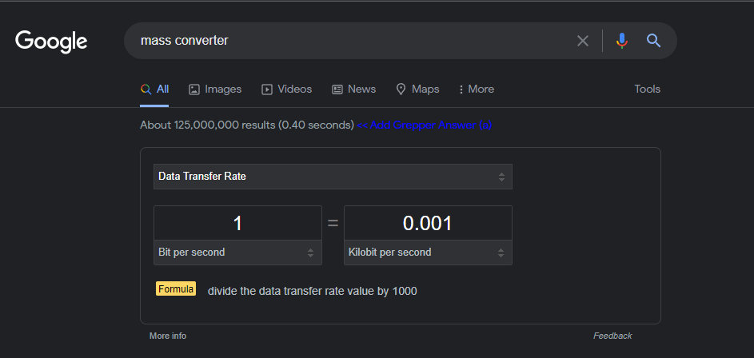
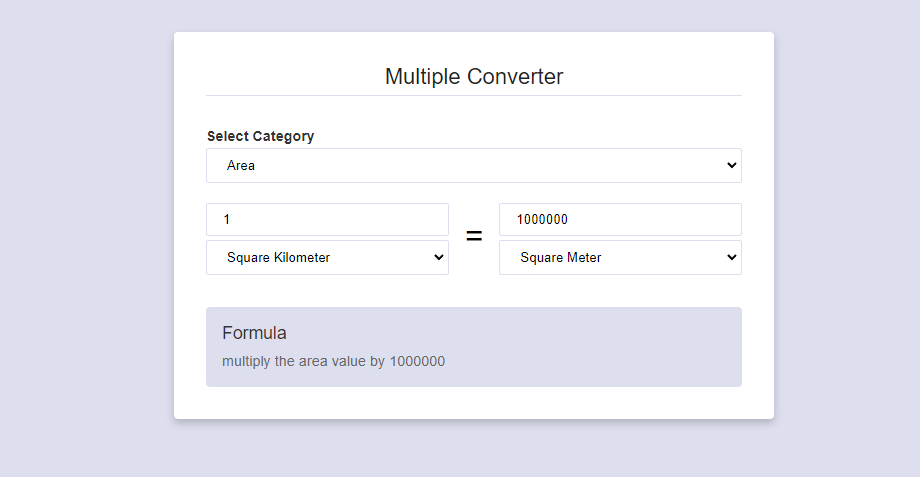

# WB Multi Converter

A fully functional vanilla js multi converter project. The business logic is totally separated from DOM. Idea comes from googles multi converted project. This project is open to add multiple categories and units. Just need to change the configuration object. Do not need to touch inside any DOM related codes.

[Live Demo]()

